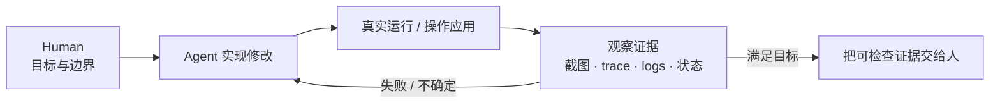
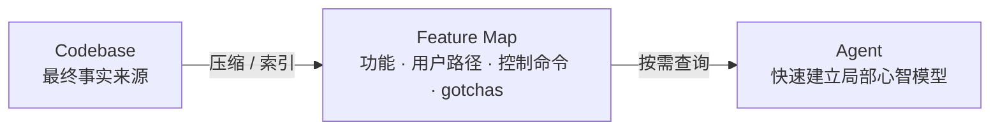
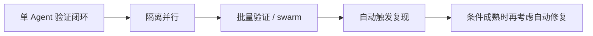

# pstack 完整指南（第一部分）：验证就是你所需要的一切

The Complete Guide to pstack Pt. 1

Lauren Tan (@poteto) · 2026-09-01 · [原文](https://x.com/poteto/status/2094457600259842065)

这篇文章最重要的不是 pstack 有多少个 Skill，而是一个工程判断：**在扩大 Agent 自主性之前，先让它能在真实运行环境里验证自己的工作。** 当 Agent 能启动应用、操作功能、观察日志/截图/trace、判断是否满足目标，并在失败时继续修正，人就不必再替每个 Agent 手工闭环。

作者把这套能力落成三块：可观测、可控制的运行时；Agent 友好的控制 CLI；描述功能入口与操作方式的 Feature Map。它们共同组成 verification skill 的基础设施。只有这套闭环稳定后，作者才建议把相同能力复制到 Cloud Agents、swarm 和自动化 routines。

## Agent 真正的瓶颈，是改完以后仍然需要人替它确认

verification 在文中的含义，不是“跑过测试”，而是 **Agent 能自己把实现—运行—观察—修正这个循环走完**。

如果这个回路断在“确认结果”上，人仍然是瓶颈：每个 Agent 都需要人替它启动应用、点 UI、看日志、判断是否修好。作者因此把 verification skill 看作 critical infrastructure，而不是普通提示模板。

[原文依据：Part 1 – Verification is all you need](https://x.com/poteto/status/2094457600259842065)

## 高质量验证不是一页 Markdown，而是一套 Agent 可直接调用的控制面

作者提出 **Build the Lever**：与其告诉 Agent 一大段“如何验证”，不如把你手工调试应用时会做的动作做成稳定 CLI。

三层关系可以理解为：

1. **Runtime / Debugging substrate**：应用能被启动、控制与观察，例如 CDP、模拟器、日志、性能工具、测试数据。
2. **Control CLI**：把 navigation、click、type、screenshot、trace、doctor 等动作封装成稳定接口。
3. **Verification Skill**：规定什么时候调用这些工具、检查什么、什么算完成。

作者建议 CLI 可组合、支持 `--dry-run`、使用子命令渐进披露、错误信息能指导 Agent 下一步、帮助文本充分，并尽量返回 JSON 等机器可读输出。

这里的价值在于把“每次临时推理如何操作应用”变成“调用稳定工具”，从而减少重复 token 消耗，也让验证过程更可复现、更容易测试。

[原文依据：Make it Reproducible；CLI design guidance](https://x.com/poteto/status/2094457600259842065)

## 控制工具解决“怎么操作”，Feature Map 解决“应该去哪里操作”

应用变大后，Agent 即使会点击和截图，也仍要找到正确功能。作者为此设计 Feature Map：一组可搜索的 Markdown 索引，描述功能是什么、用户如何到达、如何用控制 CLI 驱动，以及有哪些 gotchas。

作者把它称为一种 **materialized memory**。重要的是，它不是代码之外的第二份永久真相，而是为了节省上下文而生成的紧凑索引，所以会随着产品变化而过期。作者建议至少每天运行一次 `/maintain-verification-skill` 来更新这套能力。

[原文依据：Keep agents smart with Feature Maps；Invest in your verification skill](https://x.com/poteto/status/2094457600259842065)

## 并行和自动化是验证成熟后的结果，不是起点

作者先要求单个 Agent 能稳定验证，再扩展到：

- Cloud Agents：在隔离机器上并行运行同一套 dev / verification 环境。
- swarm：对性能收益等结论跑更多样本，或做 fuzz 验证。
- routines / automations：监听用户反馈并自动尝试复现；能力足够可靠后，才进一步考虑自动修复。

这条顺序很重要：**更多 Agent 只能复制已有的闭环能力；如果单个 Agent 还需要人替它确认，增加并发只会放大人工兜底。**

[原文依据：Cloud Agents；How to use your verification skill](https://x.com/poteto/status/2094457600259842065)

## 最值得迁移的是“闭合反馈”，不是把作者的规模数字当作普遍结论

文章给出了明确的工程机制和实践例子，但证据强度需要分开看：

- **可以直接理解为作者工程方法的部分**：真实运行、控制 CLI、Feature Map、持续维护、验证成熟后再扩大并行。
- **不能当成普遍效果证明的部分**：作者报告 pstack 支撑“每月 2,000 PR”以及“100–1000x 团队产出”，正文没有给出对照组、统一质量指标或失败率数据。
- **验证能力不等于验证目标正确**：自动脚本可能检查错条件。verification-first 解决的是“Agent 能执行检查并根据反馈继续”，不是保证检查设计天然正确。
- **运行时可调试性有建设成本**：难启动、难复现、难观测的系统，需要先补 dev tooling。
- **Feature Map 是缓存，不是源代码替代品**：产品变化后需要更新，否则会把过期上下文快速传播给更多 Agent。
- **具体产品与方法要分开**：Cursor Cloud Agents、Automations、Grok Bot routines 是作者环境中的载体；“先让 Agent 产生可检查证据，再扩大自主性”才是可迁移原则。

## 你抓住的是“验证闭环”，还是只记住了工具名？

### 1. 为什么测试通过仍不等于作者所说的“Agent 已经能验证自己的工作”？

展开参考答案

参考解释：作者要求 Agent 能操作真实应用并观察实际结果。测试只覆盖预先编码的断言；涉及 UI、运行时状态、性能或真实交互时，还需要启动、复现、操作和收集对应证据。

对照要点：验证是“真实执行 + 观察 + 证据”，而不只是“有测试”。

容易误解：认为增加更多测试文件就自动等于建立完整 verification skill。

回查：[验证闭环](#loop) · [可复现控制工具](#lever) · [原文 Part 1](https://x.com/poteto/status/2094457600259842065)

### 2. 一个 Agent 已经有能点击 UI 的 CLI，为什么作者还要 Feature Map？

展开参考答案

参考解释：CLI 解决“怎样执行动作”，但大型应用里 Agent 仍要知道“有哪些功能、从用户视角怎么到达、哪个命令控制哪个界面、有哪些例外”。Feature Map 把高频探索结果压缩成可搜索索引，减少每次从头建立上下文。

对照要点：工具能力和产品知识是两种不同上下文。

容易误解：把 Feature Map 当成代码之外的第二份永久真相；作者反而强调它必须持续维护。

回查：[Feature Map](#memory) · [原文 Feature Maps](https://x.com/poteto/status/2094457600259842065)

### 3. 如果验证脚本本身检查错了条件，能否仅凭“Agent 自己跑过验证”确认修改正确？

展开参考答案

参考解释：不能。verification skill 解决的是让 Agent 有能力执行检查并根据反馈迭代，但检查本身仍可能设计错误。文章强调的是把反馈闭环做成基础设施，不是证明任何自动检查天然可靠。

对照要点：“能验证”与“验证目标正确”要分开。

容易误解：把 verification-first 理解成只要验证自动化，人就不再需要设计边界和审查证据。

回查：[证据与边界](#boundaries)

### 4. 为什么作者把 Cloud Agents 和自动修复放在建立 verification skill 之后？

展开参考答案

参考解释：并行只会放大已有能力。如果单个 Agent 还不能稳定启动应用、控制功能和判断结果，那么同时运行更多 Agent 只会增加需要人兜底的失败。先把单 Agent 的反馈闭环做稳，才有条件复制到隔离并行环境和自动触发任务。

对照要点：先闭环，再复制闭环。

容易误解：把“更多 Agent”本身当作吞吐量提升的充分条件。

回查：[从闭环到规模化](#scale) · [原文 Cloud Agents / Automations](https://x.com/poteto/status/2094457600259842065)

## 原文与阅读范围

已读取 Thread Navigator 展开的完整正文，从系列背景、verification skill 构建、控制 CLI、Cloud Agents、Feature Map，到具体使用方式与维护建议。笔记压缩命令枚举、安装步骤和产品推广信息，保留“闭环验证 → 工具化控制 → 共享记忆 → 规模化”的主线，并把作者的产出倍数与 PR 数量保留为实践主张而非普遍证据。

[The Complete Guide to pstack Pt. 1](https://x.com/poteto/status/2094457600259842065) · Lauren Tan (@poteto) · X · 2026-09-01
