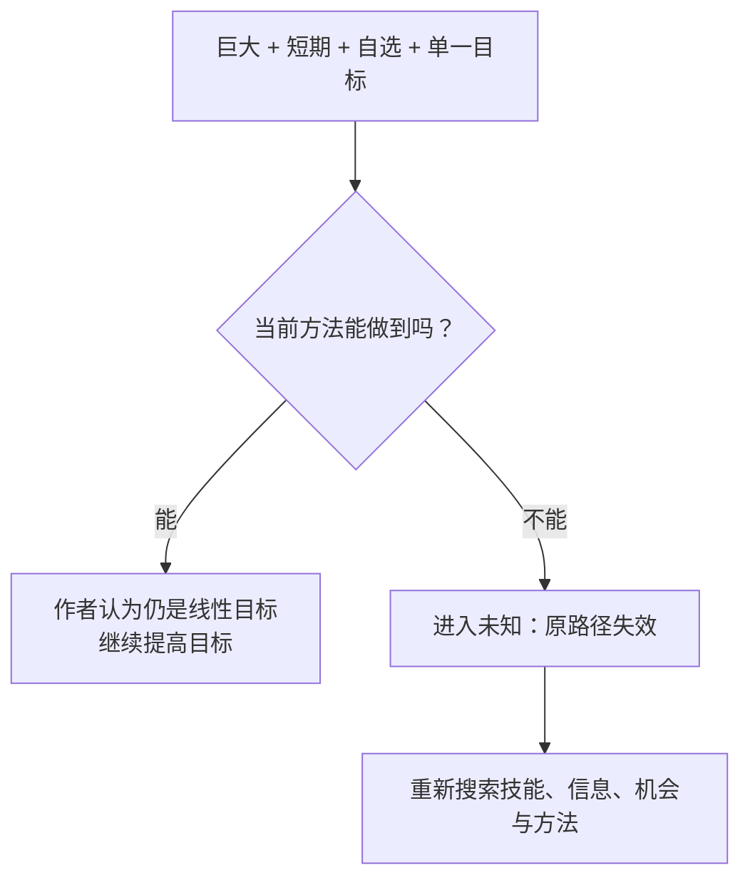

# 如果你想成功，就需要一点“妄想”

You need to be delusional if you want to succeed

Dan Koe · 2026-09-12 · [原文](https://letters.thedankoe.com/p/you-need-to-be-delusional-if-you)

Dan Koe 认为，目标最重要的作用不是作为终点，而是成为注意力的过滤器。一个足够大、足够短期、由自己选择且单一的“妄想式目标”，会迫使你承认当前方法不够用，删掉无关投入，并寻找更高杠杆的路径。这个框架适合用来检查自己正在优化什么，但原文主要是观点、个人经验和案例，不足以证明“极端目标”普遍导致成功。

## 目标先改变你看见什么，再改变你做什么

作者的核心转折是：**目标不是一个等待抵达的终点，而是一副决定什么重要、什么可以忽略的“镜片”。**

一个“现实目标”通常允许你沿用现有能力、习惯与社会默认路径；一个作者所谓的“妄想式目标”，则必须让当前做法明显失效。正因为原路径不够，注意力才会开始寻找原来会被当作噪音的信息、机会和方法。

作者用 Tommy 与 Johnny 的对比说明这一点：若目标只是获得一份体面的工作，很多超出这条路径的信息会被过滤掉；若目标远超当前能力，原有路线首先会暴露为“不够用”。这是作者的解释性例子，不是实验结果。

[原文依据：Why “realistic” goals...；The psychology of delusional goals；How to enter...](https://letters.thedankoe.com/p/you-need-to-be-delusional-if-you)

## “妄想式目标”真正做的，是打断线性优化

作者给这种目标设了三个关键条件：结果要大到当前身份与能力无法线性推出；时间要短到旧方法明显不够；目标必须由自己选择且保持单一。

这三个条件共同制造一个判断：**“如果继续像现在这样做，我到不了那里。”** 这一步比目标本身更关键，因为它把问题从“更努力执行旧计划”变成“旧计划是不是根本不成立”。

图意：目标越过当前路径后，作用不是凭空保证结果，而是迫使你重新搜索路径。

作者把这种变化进一步解释为 selective attention，并延伸到神经可塑性、flow、dopamine 等心理与神经机制。但文章没有给出研究来源来支持这些具体因果链，所以更稳妥的理解是：**“目标会影响注意与选择”是文章的解释框架；文中的生理机制不是本文已经证明的结论。**

[原文依据：The psychology of delusional goals；Step 1](https://letters.thedankoe.com/p/you-need-to-be-delusional-if-you)

## 从目标到行动，作者实际上给了“定向—删减—杠杆”三步

### 1. 定向：安装一个新的视角

先设一个对现在的自己而言不可能、时间也不可能的目标，再问：现有方式能做到吗？如果答案是“能”，作者认为目标还不够远。最终目标还要是自己选的，而不是父母、行业、文化或算法继承来的。

### 2. 删减：给“不做什么”设标准

目标确定后，作者要求审计习惯、项目、客户、关系、日程与义务，把明显不服务目标的东西移除。他强调的不是“把每件事都做得更高效”，而是**先停止优化不该继续存在的投入**。

### 3. 杠杆：寻找少数真正改变结果的路径

当低价值投入被删掉后，注意力集中到少数高杠杆动作。作者用健身和自己从自由职业收入走向月入 10 万美元的经历举例：不再只靠“持续发帖”，而是寻找产品、分发和借用他人受众等 force multipliers。

这里最可迁移的，不是某个收入目标，而是这条检查链：**我在优化什么？哪些事情即使做得更好也不会改变结果？真正改变约束的杠杆在哪里？**

[原文依据：Step 1–3](https://letters.thedankoe.com/p/you-need-to-be-delusional-if-you)

## 这是一篇有启发性的观点文，不是“极端目标必然成功”的证据

作者使用 Steve Jobs 的 Reality Distortion Field、Tommy/Johnny 假设、自己的收入经历和健身例子来支撑主张。这些材料能说明他如何理解“目标改变注意与行动”，但不能证明所有人采用极端目标后都会获得更好结果。

需要保留几条边界：

- **目标是过滤器，不等于预测器。** 看见不同机会，并不保证机会存在、判断正确或执行成功。
- **“是否命中目标不重要”是作者的价值判断。** 更高目标可能带来更大进步，也可能带来错误估计、资源浪费或不可持续投入；原文没有系统比较这些失败成本。
- **单一目标与彻底删减有代价。** 工作、家庭、健康、关系等并不总能按一个目标统一排序；把所有“不服务目标”的关系或义务都删除，并不是本文证据能够普遍支持的做法。
- **神经科学表述证据不足。** 文章对 neuroplasticity、dopamine、serotonin、oxytocin、cortisol 与 flow 的具体作用给出强解释，但没有引用研究，不能把这些机制当成已经由本文验证的科学结论。
- **案例存在幸存者偏差风险。** Jobs 和作者自己的成功经验可以启发，但不能代表采用同样心态的人群总体结果。

因此，这篇文章更适合作为一个**认知工具**：用夸张目标暴露旧路径的局限，再重新审视注意力、删减与杠杆；而不是把“妄想”本身当作成功原因。

## 能否把作者真正的主张讲出来？

### 1. 为什么作者说“目标不是终点，而是过滤器”？

展开参考答案

参考解释：因为目标会决定哪些信息、机会和行动被看作与自己相关。作者认为，不同目标会让同一个人注意到不同路径，因此目标先改变“看见什么”，再影响“做什么”。

对照要点：说出注意力选择，而不是只说“目标让人更有动力”。

容易误解：把过滤器理解成“只要相信目标，现实就会自动改变”。

回查：[目标与过滤器](#filter) · [原文相关章节](https://letters.thedankoe.com/p/you-need-to-be-delusional-if-you)

### 2. 为什么“更努力执行当前计划”不符合作者对妄想式目标的定义？

展开参考答案

参考解释：作者要求目标必须让当前技能、习惯与方法明显无法达到。如果现有方式只要加量就能做到，它仍是线性目标；妄想式目标的作用正是迫使人重新搜索路径。

对照要点：当前方法失效 → 搜索新路径。

容易误解：把“目标越高越好”与“盲目加压”画等号。

回查：[打断线性优化](#mechanism) · [原文 Step 1](https://letters.thedankoe.com/p/you-need-to-be-delusional-if-you)

### 3. 哪部分最值得保留，哪部分最不能直接当成事实？

展开参考答案

参考解释：可保留的工具是“目标作为注意力过滤器，以及定向—删减—寻找杠杆”的检查框架。最需要保留怀疑的是极端目标必然带来成功，以及文中没有研究来源支撑的神经递质、神经可塑性等具体因果解释。

对照要点：区分方法论启发与证据强度。

容易误解：要么全盘接受，要么因为证据不足就认为整篇文章没有任何思考价值。

回查：[证据与边界](#boundaries) · [原文全文](https://letters.thedankoe.com/p/you-need-to-be-delusional-if-you)

## 原文与阅读范围

已读取正文从开场问题到 Step 3 及结尾。笔记保留“目标作为过滤器”“让旧路径失效”“定向—删减—杠杆”这三层主线；压缩了五种 intrinsic drivers 的神经递质说明、推广内容和重复激励性表达。相关神经科学说法因原文未给出处，被放入边界而非作为核心机制。

[You need to be delusional if you want to succeed](https://letters.thedankoe.com/p/you-need-to-be-delusional-if-you) · Dan Koe · The Dan Koe Letter · 2026-09-12
