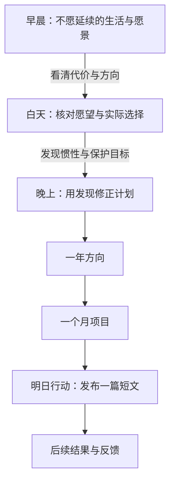

# 如何用一天重整整个人生

How to fix your entire life in 1 day

Dan Koe · 2025-12-23 · [原文](https://letters.thedankoe.com/p/how-to-fix-your-entire-life-in-1)

为什么明明想改变，却总回到原来的生活？Dan Koe 的回答是：先辨认行为在保护什么，再重新选择方向，通过行动与反馈让改变发生。一天是重新定向的起点。

## 同一个行为，可能服务着两个冲突的目标

小林想写作却迟迟不发。假设他也在保护“我不会出丑”的自我形象，自律要求就可能撞上这个保护目标。

作者认为，表面愿望不一定是实际行为优先服务的目标。拖延可能保护人免受评价；只增加自律要求，未必触及这种保护。自我认同是“我认为自己是哪种人”：当行动威胁这种认识，人可能维护旧定义，继续选择熟悉的行为。

辅助假设：小林想写文章，却迟迟不发布。如果他同时想维护“我不会出丑”的形象，不发布就有了保护作用。此时，写作愿望与避开评价的目标在争夺同一次选择。这是解释例子，不是对拖延者的诊断。

关键连接：若阻力来自保护旧定义，改变就需要重新审视它。把自己理解为“可以用不成熟的作品学习的人”，会允许不同的行动；光换一句自我描述，还不能证明行为已经改变。后面的一天练习，就是为了把这种冲突看清，并选出下一步。

[原文依据：II–III](https://letters.thedankoe.com/p/how-to-fix-your-entire-life-in-1)

图意：写作愿望与避免出丑的保护目标争夺同一次发布选择；看清冲突后，重新选择行动，再从结果学习。这是辅助假设与阅读归纳。

## 先让冲突可见，再把方向落实为行动

先看清冲突，才能重新选择。早晨给方向，白天用实际行为核对，晚上将发现变成下一步。

写作是辅助假设。小行动推进项目，项目服务方向；约束贯穿行动，先写清不愿牺牲什么。

作者安排早晨反思、白天观察、晚上整理。三段分别连接“我想要什么”“我实际在做什么”“接下来怎样做”，而不只是三个时间点。

早晨：辨认不愿延续的生活与暂定愿景。把维持现状的代价看具体，才能重新权衡熟悉感与改变；也要有希望走向的方向，否则不满本身没有行动指向。

白天：用提醒打断惯性，把愿望与实际行为对照。作用是发现自己正在保护什么，避免反思结束后又照旧生活。

晚上：把发现整理成一年方向、一个月项目与明日行动；每日行动推进项目，项目服务方向，同时写清不愿牺牲的东西。愿景可以随经验调整。

继续小林的假设：早晨发现自己既想表达又怕出丑；白天察觉自己不断润色却回避发布；晚上把“成为作者”收窄为“明天发布一篇短文”的尝试。这只是帮助理解三段作用的例子，并非原文清单或保证有效的方案。

[原文依据：VI–VII](https://letters.thedankoe.com/p/how-to-fix-your-entire-life-in-1)

## 结果与代价，一起用于调整行动

计划落到行动，才有结果可观察。对照目标和不愿牺牲的界限，调整后继续尝试；换一句自我描述不能代替行动。

一天能整理出方向，不能替代之后的生活。作者用反馈解释后续：行动后观察结果，对照目标，再据此调整行动。它把愿景接到经验，避免新的目标再次停留在想象里。

继续这个假设：文章发布后反响不佳，并不能自动证明“小林不适合写作”。他还需要观察具体反馈，决定下一次尝试改什么。这里的要点是利用结果改变做法；机械重复或仅改自我描述，都没有完成这个回路。

[原文依据：V、VII](https://letters.thedankoe.com/p/how-to-fix-your-entire-life-in-1)

阅读归纳：把反馈与约束合起来看，判断一次做法时，既看它是否推进项目，也看代价是否越过自己不愿牺牲的界限。假设小林约定保留休息时间，发布做法却持续挤占休息，即使产出增加，也需要重新选择做法。这个例子解释约束如何参与判断，不是作者给出的具体处方。原文允许愿景演化，但没有提供何时改方向、何时只改做法的统一判据。

## 理解作者的解释，不等于接受普遍承诺

这些关系是作者的观点及笔记归纳。不能从拖延直接诊断动机，也不能把资源与处境困难归为“不够想要”。

经验、例子、框架与反馈类比 → 提供可尝试的思路；缺少整套练习的对照研究 → 不能推出人人有效或一天改变人生。心理发展框架见原文 IV，本笔记不展开。

原文主要依靠个人经验、例子、心理发展框架与控制论类比展开论述，没有提供验证整套一天练习效果的对照研究。作者承认它不保证适合每个人；机会与行动能力也是文中条件。练习还占用一天，并可能带来不舒服的自我审视。

阅读判断：不能从拖延直接推断恐惧评价，也不能把资源、处境造成的困难归为意愿不足。一天后的清晰感与持续行为变化，是不同结果；文中关于任何目标都能实现的强断言，不应当成已证实的保证。

[原文依据：V–VI；全文证据类型判断](https://letters.thedankoe.com/p/how-to-fix-your-entire-life-in-1)

## 能否把整条思路讲出来？

以下为笔记编写的可选问题。先回答，再按需展开对照。

### 1. 为什么给小林增加“必须自律”的要求，可能仍然无效？

展开参考答案

参考解释：假设中，回避发布在维护不会出丑的形象。增加要求没有处理这个冲突；需要重新审视旧定义，并以实际行动检验变化。

对照要点：说清行为的保护作用及行动的重要性。

容易误解：把所有拖延都归因于同一种心理。

回查：[笔记解释](#core) · [原文 II–III](https://letters.thedankoe.com/p/how-to-fix-your-entire-life-in-1)

### 2. 为什么白天观察不能简单省略，只在晚上写计划？

展开参考答案

参考解释：按作者思路，观察把自述愿望与实际选择相对照，帮助发现惯性和隐性目标；否则计划可能沿用未经检查的判断。

对照要点：连接反思、行为观察与后续选择。

容易误解：把三段只当作时间安排。

回查：[笔记解释](#practice) · [原文 VI](https://letters.thedankoe.com/p/how-to-fix-your-entire-life-in-1)

### 3. 一次尝试不理想，接下来怎样才算利用了反馈？

展开参考答案

参考解释：观察结果，对照目标，再决定下一次如何调整。一次结果既不证明整个人的能力，也不证明整套方法有效。

对照要点：从结果到调整，而非机械重复。

容易误解：把失败归结为身份，或把坚持当成反馈。

回查：[笔记解释](#feedback) · [原文 V](https://letters.thedankoe.com/p/how-to-fix-your-entire-life-in-1)

## 原文与阅读范围

正文 I–VII 已读取。这里围绕行为冲突、练习作用与后续反馈重组；未展开 IV 的九阶段模型、完整练习问题及游戏类比细节。小林是笔记的辅助假设，不是作者报告的案例。

[How to fix your entire life in 1 day](https://letters.thedankoe.com/p/how-to-fix-your-entire-life-in-1) · Dan Koe · The Dan Koe Letter · 2025-12-23
